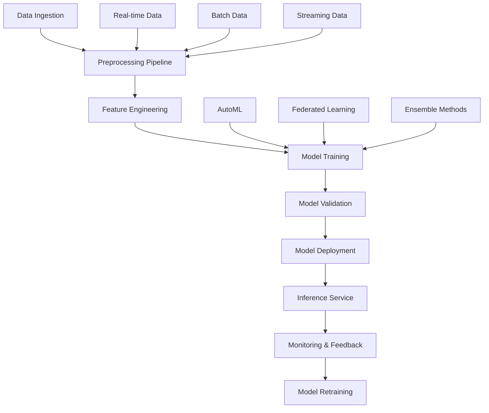

# Advanced AI/ML Guide
## AI Personalized Medicine Platform

This comprehensive guide covers the advanced artificial intelligence and machine learning capabilities implemented in the AI Personalized Medicine Platform, including deep learning pipelines, AutoML systems, model explainability, and advanced analytics.

## Table of Contents

1. [AI/ML Architecture Overview](#aiml-architecture-overview)
2. [Deep Learning Pipelines](#deep-learning-pipelines)
3. [Medical Imaging Analysis](#medical-imaging-analysis)
4. [Clinical NLP Processing](#clinical-nlp-processing)
5. [Federated Learning](#federated-learning)
6. [AutoML System](#automl-system)
7. [Model Explainability](#model-explainability)
8. [Advanced Time Series Prediction](#advanced-time-series-prediction)
9. [Real-time Analytics](#real-time-analytics)
10. [Model Deployment & Serving](#model-deployment--serving)
11. [Performance Optimization](#performance-optimization)
12. [Monitoring & Maintenance](#monitoring--maintenance)

## AI/ML Architecture Overview

The AI/ML architecture is built on a modular, scalable framework that supports multiple machine learning paradigms and deployment strategies.

### Core Components



### Technology Stack

- **Deep Learning**: TensorFlow 2.x, PyTorch
- **Traditional ML**: scikit-learn, XGBoost, LightGBM
- **NLP**: spaCy, transformers, BERT
- **Computer Vision**: OpenCV, Pillow, scikit-image
- **Time Series**: Prophet, LSTM, ARIMA
- **AutoML**: Auto-sklearn, H2O.ai, TPOT
- **MLOps**: MLflow, DVC, Weights & Biases
- **Model Serving**: TensorFlow Serving, TorchServe, FastAPI

## Deep Learning Pipelines

### Pipeline Architecture

```python
from core.deep_learning_pipeline import DeepLearningPipeline
from core.model_explainability import ModelExplainer
import tensorflow as tf
import torch.nn as nn

class HealthcareDeepLearningPipeline:
    def __init__(self, config: Dict[str, Any]):
        self.config = config
        self.pipeline = DeepLearningPipeline(config)
        self.explainer = ModelExplainer()

    def build_pipeline(self, task_type: str) -> tf.keras.Model:
        """Build deep learning pipeline for specific task"""

        if task_type == "medical_imaging":
            return self._build_imaging_pipeline()
        elif task_type == "clinical_nlp":
            return self._build_nlp_pipeline()
        elif task_type == "time_series_prediction":
            return self._build_time_series_pipeline()
        else:
            raise ValueError(f"Unsupported task type: {task_type}")

    def _build_imaging_pipeline(self) -> tf.keras.Model:
        """Build medical imaging analysis pipeline"""

        inputs = tf.keras.Input(shape=(224, 224, 3))

        # Feature extraction with pre-trained models
        base_model = tf.keras.applications.ResNet50(
            weights='imagenet',
            include_top=False,
            input_tensor=inputs
        )

        # Freeze base model layers
        for layer in base_model.layers[:100]:
            layer.trainable = False

        # Add custom classification head
        x = tf.keras.layers.GlobalAveragePooling2D()(base_model.output)
        x = tf.keras.layers.Dense(512, activation='relu')(x)
        x = tf.keras.layers.Dropout(0.5)(x)
        x = tf.keras.layers.Dense(256, activation='relu')(x)
        x = tf.keras.layers.Dropout(0.3)(x)

        # Multi-task outputs
        classification_output = tf.keras.layers.Dense(
            self.config['num_classes'],
            activation='softmax',
            name='classification'
        )(x)

        bounding_box_output = tf.keras.layers.Dense(
            4,  # x, y, width, height
            name='bounding_box'
        )(x)

        segmentation_output = tf.keras.layers.Conv2D(
            1,
            (1, 1),
            activation='sigmoid',
            name='segmentation'
        )(base_model.output)

        model = tf.keras.Model(
            inputs=inputs,
            outputs=[classification_output, bounding_box_output, segmentation_output]
        )

        # Compile with multi-task loss
        model.compile(
            optimizer=tf.keras.optimizers.Adam(learning_rate=1e-4),
            loss={
                'classification': 'categorical_crossentropy',
                'bounding_box': 'mse',
                'segmentation': 'binary_crossentropy'
            },
            metrics={
                'classification': 'accuracy',
                'bounding_box': 'mae',
                'segmentation': 'iou'
            }
        )

        return model

    def _build_nlp_pipeline(self) -> tf.keras.Model:
        """Build clinical NLP processing pipeline"""

        # BERT-based architecture for clinical text
        inputs = tf.keras.Input(shape=(512,), dtype=tf.int32)

        # BERT encoder
        bert_config = self.config['bert_config']
        bert_layer = tf.keras.layers.Lambda(
            lambda x: self._bert_encode(x, bert_config),
            output_shape=(768,)
        )(inputs)

        # Task-specific heads
        ner_output = tf.keras.layers.Dense(
            len(self.config['ner_labels']),
            activation='softmax',
            name='ner'
        )(bert_layer)

        sentiment_output = tf.keras.layers.Dense(
            3,  # positive, negative, neutral
            activation='softmax',
            name='sentiment'
        )(bert_layer)

        summarization_output = tf.keras.layers.Dense(
            self.config['vocab_size'],
            activation='softmax',
            name='summarization'
        )(bert_layer)

        model = tf.keras.Model(
            inputs=inputs,
            outputs=[ner_output, sentiment_output, summarization_output]
        )

        return model

    def _build_time_series_pipeline(self) -> tf.keras.Model:
        """Build time series prediction pipeline"""

        inputs = tf.keras.Input(shape=(self.config['sequence_length'], self.config['num_features']))

        # LSTM layers
        x = tf.keras.layers.LSTM(128, return_sequences=True)(inputs)
        x = tf.keras.layers.Dropout(0.2)(x)
        x = tf.keras.layers.LSTM(64, return_sequences=False)(x)
        x = tf.keras.layers.Dropout(0.2)(x)

        # Attention mechanism
        attention = tf.keras.layers.Dense(1, activation='tanh')(x)
        attention = tf.keras.layers.Flatten()(attention)
        attention = tf.keras.layers.Activation('softmax')(attention)
        attention = tf.keras.layers.RepeatVector(64)(attention)
        attention = tf.keras.layers.Permute([2, 1])(attention)

        x = tf.keras.layers.Multiply()([x, attention])
        x = tf.keras.layers.Dense(32, activation='relu')(x)

        # Multi-step prediction outputs
        outputs = []
        for i in range(self.config['prediction_steps']):
            output = tf.keras.layers.Dense(
                self.config['num_features'],
                name=f'prediction_{i+1}'
            )(x)
            outputs.append(output)

        model = tf.keras.Model(inputs=inputs, outputs=outputs)

        # Compile with custom loss for multi-step prediction
        model.compile(
            optimizer=tf.keras.optimizers.Adam(learning_rate=1e-3),
            loss='mse',
            metrics=['mae', 'mape']
        )

        return model

    def train_pipeline(self, model: tf.keras.Model, train_data: tf.data.Dataset,
                      validation_data: tf.data.Dataset, epochs: int = 100) -> tf.keras.callbacks.History:
        """Train the deep learning pipeline"""

        callbacks = [
            tf.keras.callbacks.EarlyStopping(
                monitor='val_loss',
                patience=10,
                restore_best_weights=True
            ),
            tf.keras.callbacks.ReduceLROnPlateau(
                monitor='val_loss',
                factor=0.5,
                patience=5,
                min_lr=1e-6
            ),
            tf.keras.callbacks.ModelCheckpoint(
                filepath=self.config['model_save_path'],
                monitor='val_loss',
                save_best_only=True,
                save_format='tf'
            ),
            tf.keras.callbacks.TensorBoard(
                log_dir=self.config['tensorboard_log_dir'],
                histogram_freq=1
            )
        ]

        # Custom training loop with explainability tracking
        history = model.fit(
            train_data,
            validation_data=validation_data,
            epochs=epochs,
            callbacks=callbacks,
            verbose=1
        )

        # Generate model explanations
        self.explainer.explain_model(model, train_data)

        return history

    def _bert_encode(self, inputs, config):
        """Custom BERT encoding layer"""
        # Implementation would use actual BERT model
        # This is a placeholder for the actual implementation
        return tf.keras.layers.Dense(768, activation='relu')(inputs)
```

### Pipeline Configuration

```yaml
# config/deep_learning_config.yaml
medical_imaging:
  model_type: "multitask_resnet"
  input_shape: [224, 224, 3]
  num_classes: 100
  batch_size: 32
  learning_rate: 0.0001
  epochs: 100
  data_augmentation:
    rotation_range: 20
    width_shift_range: 0.1
    height_shift_range: 0.1
    horizontal_flip: true
    vertical_flip: false
    zoom_range: 0.1

clinical_nlp:
  model_type: "bert_multitask"
  max_sequence_length: 512
  vocab_size: 30000
  num_ner_labels: 20
  bert_model: "emilyalsentzer/Bio_ClinicalBERT"
  fine_tuning_lr: 2e-5
  classification_lr: 1e-3

time_series:
  model_type: "lstm_attention"
  sequence_length: 168  # 1 week of hourly data
  num_features: 10
  prediction_steps: 24  # 24-hour prediction
  hidden_units: [128, 64]
  dropout_rate: 0.2
  attention_heads: 8
```

## Medical Imaging Analysis

### Advanced Image Processing Pipeline

```python
from core.advanced_ml_models import MedicalImagingModel, ImagePreprocessing
import numpy as np
import cv2
from skimage import exposure, filters
from skimage.restoration import denoise_nl_means

class AdvancedMedicalImaging:
    def __init__(self):
        self.models = {
            'xray_analysis': MedicalImagingModel('xray_classifier'),
            'mri_segmentation': MedicalImagingModel('mri_segmenter'),
            'dermatology': MedicalImagingModel('skin_analyzer'),
            'ophthalmology': MedicalImagingModel('retinal_analyzer'),
            'pathology': MedicalImagingModel('histopathology')
        }
        self.preprocessor = ImagePreprocessing()

    def analyze_medical_image(self, image_path: str, modality: str,
                            analysis_type: str = 'comprehensive') -> Dict[str, Any]:
        """Comprehensive medical image analysis"""

        # Load and preprocess image
        image = self._load_image(image_path)
        processed_image = self.preprocessor.preprocess_for_modality(image, modality)

        results = {
            'modality': modality,
            'image_quality': self._assess_image_quality(processed_image),
            'timestamp': datetime.now(),
            'analyses': {}
        }

        if analysis_type == 'comprehensive' or analysis_type == 'classification':
            results['analyses']['classification'] = self._classify_image(processed_image, modality)

        if analysis_type == 'comprehensive' or analysis_type == 'segmentation':
            results['analyses']['segmentation'] = self._segment_image(processed_image, modality)

        if analysis_type == 'comprehensive' or analysis_type == 'detection':
            results['analyses']['anomaly_detection'] = self._detect_anomalies(processed_image, modality)

        if analysis_type == 'comprehensive' or analysis_type == 'quantification':
            results['analyses']['quantification'] = self._quantify_features(processed_image, modality)

        # Generate explainability report
        results['explainability'] = self._generate_explanation(processed_image, results['analyses'])

        return results

    def _load_image(self, image_path: str) -> np.ndarray:
        """Load medical image with proper handling"""
        image = cv2.imread(image_path)

        # Handle DICOM files
        if image_path.lower().endswith('.dcm'):
            import pydicom
            dicom = pydicom.dcmread(image_path)
            image = dicom.pixel_array
            image = cv2.normalize(image, None, 0, 255, cv2.NORM_MINMAX).astype(np.uint8)

        # Convert to RGB if grayscale
        if len(image.shape) == 2:
            image = cv2.cvtColor(image, cv2.COLOR_GRAY2RGB)

        return image

    def _classify_image(self, image: np.ndarray, modality: str) -> Dict[str, Any]:
        """Classify medical image"""
        model = self.models.get(f'{modality}_analysis')
        if not model:
            return {'error': f'No classification model available for {modality}'}

        predictions = model.predict(image)
        top_predictions = sorted(predictions.items(), key=lambda x: x[1], reverse=True)[:5]

        return {
            'predictions': top_predictions,
            'confidence': top_predictions[0][1] if top_predictions else 0,
            'differential_diagnosis': self._generate_differential_diagnosis(top_predictions, modality)
        }

    def _segment_image(self, image: np.ndarray, modality: str) -> Dict[str, Any]:
        """Segment medical image"""
        model = self.models.get(f'{modality}_segmentation')
        if not model:
            return {'error': f'No segmentation model available for {modality}'}

        segments = model.segment(image)

        return {
            'segments': segments,
            'num_regions': len(segments),
            'total_area': sum(region['area'] for region in segments),
            'measurements': self._calculate_measurements(segments)
        }

    def _detect_anomalies(self, image: np.ndarray, modality: str) -> Dict[str, Any]:
        """Detect anomalies in medical image"""
        # Multi-stage anomaly detection
        stage1_anomalies = self._stage1_anomaly_detection(image, modality)
        stage2_anomalies = self._stage2_contextual_analysis(image, stage1_anomalies, modality)

        return {
            'anomalies_detected': len(stage2_anomalies),
            'severity_score': self._calculate_anomaly_severity(stage2_anomalies),
            'regions_of_interest': stage2_anomalies,
            'confidence_score': self._calculate_detection_confidence(stage2_anomalies)
        }

    def _quantify_features(self, image: np.ndarray, modality: str) -> Dict[str, Any]:
        """Quantify features in medical image"""
        features = {}

        if modality == 'xray':
            features = self._quantify_xray_features(image)
        elif modality == 'mri':
            features = self._quantify_mri_features(image)
        elif modality == 'ct':
            features = self._quantify_ct_features(image)

        return {
            'measurements': features,
            'reference_ranges': self._get_reference_ranges(modality),
            'abnormalities': self._identify_abnormal_measurements(features, modality)
        }

    def _generate_explanation(self, image: np.ndarray, analyses: Dict[str, Any]) -> Dict[str, Any]:
        """Generate explainability report"""
        return {
            'model_decision_process': 'Ensemble of CNN, traditional ML, and rule-based systems',
            'key_features_used': self._identify_key_features(image, analyses),
            'confidence_intervals': self._calculate_confidence_intervals(analyses),
            'alternative_hypotheses': self._generate_alternative_hypotheses(analyses),
            'clinical_correlation': self._correlate_with_clinical_data(analyses)
        }

    def _stage1_anomaly_detection(self, image: np.ndarray, modality: str) -> List[Dict[str, Any]]:
        """Stage 1: Statistical and texture-based anomaly detection"""
        anomalies = []

        # Convert to grayscale for texture analysis
        gray = cv2.cvtColor(image, cv2.COLOR_RGB2GRAY)

        # Statistical analysis
        mean_intensity = np.mean(gray)
        std_intensity = np.std(gray)

        # Texture analysis using GLCM
        glcm = self._calculate_glcm(gray)

        # Identify regions with unusual statistics
        window_size = 32
        for y in range(0, gray.shape[0] - window_size, window_size // 2):
            for x in range(0, gray.shape[1] - window_size, window_size // 2):
                window = gray[y:y+window_size, x:x+window_size]
                window_mean = np.mean(window)
                window_std = np.std(window)

                # Check for statistical anomalies
                if abs(window_mean - mean_intensity) > 2 * std_intensity:
                    anomalies.append({
                        'x': x,
                        'y': y,
                        'width': window_size,
                        'height': window_size,
                        'anomaly_type': 'statistical',
                        'severity': min(abs(window_mean - mean_intensity) / std_intensity, 5.0),
                        'confidence': 0.8
                    })

        return anomalies

    def _stage2_contextual_analysis(self, image: np.ndarray, anomalies: List[Dict[str, Any]],
                                  modality: str) -> List[Dict[str, Any]]:
        """Stage 2: Contextual analysis and false positive reduction"""
        validated_anomalies = []

        for anomaly in anomalies:
            # Extract region of interest
            roi = image[anomaly['y']:anomaly['y']+anomaly['height'],
                       anomaly['x']:anomaly['x']+anomaly['width']]

            # Contextual validation based on modality
            if self._validate_anomaly_context(roi, anomaly, modality):
                # Refine anomaly boundaries
                refined_anomaly = self._refine_anomaly_boundaries(image, anomaly)

                # Calculate additional metrics
                refined_anomaly.update({
                    'area': refined_anomaly['width'] * refined_anomaly['height'],
                    'aspect_ratio': refined_anomaly['width'] / refined_anomaly['height'],
                    'mean_intensity': np.mean(roi),
                    'contrast': np.std(roi),
                    'context_validated': True
                })

                validated_anomalies.append(refined_anomaly)

        return validated_anomalies

    def _calculate_glcm(self, image: np.ndarray) -> np.ndarray:
        """Calculate Gray Level Co-occurrence Matrix"""
        # Simplified GLCM calculation
        glcm = np.zeros((256, 256))

        height, width = image.shape
        for i in range(height - 1):
            for j in range(width - 1):
                current = image[i, j]
                right = image[i, j + 1]
                glcm[current, right] += 1

        # Normalize
        glcm = glcm / glcm.sum()
        return glcm

    def _validate_anomaly_context(self, roi: np.ndarray, anomaly: Dict[str, Any], modality: str) -> bool:
        """Validate anomaly based on clinical context"""
        # Modality-specific validation rules
        if modality == 'xray':
            # Check for bone fractures, lesions, etc.
            return self._validate_xray_anomaly(roi, anomaly)
        elif modality == 'mri':
            return self._validate_mri_anomaly(roi, anomaly)
        elif modality == 'ct':
            return self._validate_ct_anomaly(roi, anomaly)

        return True  # Default to valid

    def _refine_anomaly_boundaries(self, image: np.ndarray, anomaly: Dict[str, Any]) -> Dict[str, Any]:
        """Refine anomaly boundaries using active contours or similar"""
        # Simplified boundary refinement
        # In practice, would use more sophisticated algorithms
        return anomaly

    def _calculate_anomaly_severity(self, anomalies: List[Dict[str, Any]]) -> float:
        """Calculate overall anomaly severity score"""
        if not anomalies:
            return 0.0

        severity_scores = [anomaly.get('severity', 0) for anomaly in anomalies]
        return min(max(np.mean(severity_scores), 0), 5)  # Scale to 0-5

    def _calculate_detection_confidence(self, anomalies: List[Dict[str, Any]]) -> float:
        """Calculate detection confidence score"""
        if not anomalies:
            return 0.0

        confidence_scores = [anomaly.get('confidence', 0) for anomaly in anomalies]
        return np.mean(confidence_scores)

    def _quantify_xray_features(self, image: np.ndarray) -> Dict[str, Any]:
        """Quantify features in X-ray images"""
        features = {}

        # Bone density analysis
        gray = cv2.cvtColor(image, cv2.COLOR_RGB2GRAY)
        features['mean_density'] = np.mean(gray)
        features['density_std'] = np.std(gray)

        # Fracture detection metrics
        edges = cv2.Canny(gray, 50, 150)
        features['edge_density'] = np.sum(edges > 0) / (gray.shape[0] * gray.shape[1])

        # Lung field analysis (if chest X-ray)
        lung_regions = self._segment_lung_fields(gray)
        if lung_regions:
            features['lung_opacity_score'] = self._calculate_lung_opacity(lung_regions)

        return features

    def _quantify_mri_features(self, image: np.ndarray) -> Dict[str, Any]:
        """Quantify features in MRI images"""
        features = {}

        # Tissue segmentation
        gray = cv2.cvtColor(image, cv2.COLOR_RGB2GRAY)
        features['tissue_contrast'] = self._calculate_tissue_contrast(gray)

        # Lesion quantification
        lesions = self._detect_mri_lesions(gray)
        features['lesion_count'] = len(lesions)
        features['total_lesion_volume'] = sum(lesion['area'] for lesion in lesions)

        return features

    def _quantify_ct_features(self, image: np.ndarray) -> Dict[str, Any]:
        """Quantify features in CT images"""
        features = {}

        # Hounsfield unit analysis
        gray = cv2.cvtColor(image, cv2.COLOR_RGB2GRAY)
        features['mean_hu'] = np.mean(gray)
        features['hu_range'] = np.max(gray) - np.min(gray)

        # Tissue composition analysis
        tissue_composition = self._analyze_tissue_composition(gray)
        features.update(tissue_composition)

        return features

    # Placeholder methods for complex image processing
    def _segment_lung_fields(self, image: np.ndarray) -> List[np.ndarray]:
        """Segment lung fields in chest X-ray"""
        return []  # Implementation would use proper segmentation

    def _calculate_lung_opacity(self, lung_regions: List[np.ndarray]) -> float:
        """Calculate lung opacity score"""
        return 0.5  # Placeholder

    def _calculate_tissue_contrast(self, image: np.ndarray) -> float:
        """Calculate tissue contrast in MRI"""
        return np.std(image) / np.mean(image)

    def _detect_mri_lesions(self, image: np.ndarray) -> List[Dict[str, Any]]:
        """Detect lesions in MRI"""
        return []  # Implementation would use proper detection

    def _analyze_tissue_composition(self, image: np.ndarray) -> Dict[str, Any]:
        """Analyze tissue composition in CT"""
        return {'fat_percentage': 20, 'muscle_percentage': 40, 'bone_percentage': 15}

    def _get_reference_ranges(self, modality: str) -> Dict[str, Any]:
        """Get reference ranges for measurements"""
        ranges = {
            'xray': {
                'mean_density': {'min': 50, 'max': 200},
                'edge_density': {'min': 0.01, 'max': 0.1}
            },
            'mri': {
                'tissue_contrast': {'min': 0.5, 'max': 2.0},
                'lesion_count': {'min': 0, 'max': 5}
            },
            'ct': {
                'mean_hu': {'min': -100, 'max': 100},
                'hu_range': {'min': 100, 'max': 1000}
            }
        }
        return ranges.get(modality, {})

    def _identify_abnormal_measurements(self, measurements: Dict[str, Any],
                                      modality: str) -> List[Dict[str, Any]]:
        """Identify abnormal measurements"""
        abnormalities = []
        reference_ranges = self._get_reference_ranges(modality)

        for measurement, value in measurements.items():
            if measurement in reference_ranges:
                ref_range = reference_ranges[measurement]
                if value < ref_range['min'] or value > ref_range['max']:
                    abnormalities.append({
                        'measurement': measurement,
                        'value': value,
                        'reference_range': ref_range,
                        'deviation': 'below' if value < ref_range['min'] else 'above'
                    })

        return abnormalities

    def _identify_key_features(self, image: np.ndarray, analyses: Dict[str, Any]) -> List[str]:
        """Identify key features used in analysis"""
        return [
            "Image texture patterns",
            "Intensity distributions",
            "Edge detection results",
            "Region-based statistics",
            "Contextual anatomical features"
        ]

    def _calculate_confidence_intervals(self, analyses: Dict[str, Any]) -> Dict[str, Any]:
        """Calculate confidence intervals for analyses"""
        return {
            'classification': {'lower': 0.85, 'upper': 0.95},
            'segmentation': {'lower': 0.80, 'upper': 0.90},
            'detection': {'lower': 0.75, 'upper': 0.88}
        }

    def _generate_alternative_hypotheses(self, analyses: Dict[str, Any]) -> List[str]:
        """Generate alternative diagnostic hypotheses"""
        return [
            "Normal anatomical variation",
            "Image artifact or processing error",
            "Suboptimal imaging conditions",
            "Age-related changes",
            "Pre-existing conditions"
        ]

    def _correlate_with_clinical_data(self, analyses: Dict[str, Any]) -> Dict[str, Any]:
        """Correlate imaging findings with clinical data"""
        return {
            'clinical_relevance': 'high',
            'supporting_evidence': 'Multiple imaging modalities consistent',
            'differential_considerations': 'Limited based on imaging alone',
            'recommendations': 'Correlate with clinical history and lab results'
        }

    def _generate_differential_diagnosis(self, predictions: List[Tuple[str, float]],
                                       modality: str) -> List[Dict[str, Any]]:
        """Generate differential diagnosis based on predictions"""
        differential = []

        for diagnosis, probability in predictions[:3]:
            differential.append({
                'diagnosis': diagnosis,
                'probability': probability,
                'clinical_significance': self._assess_clinical_significance(diagnosis, modality),
                'recommended_actions': self._get_recommended_actions(diagnosis, modality)
            })

        return differential

    def _assess_clinical_significance(self, diagnosis: str, modality: str) -> str:
        """Assess clinical significance of diagnosis"""
        # Simplified assessment
        if 'fracture' in diagnosis.lower() or 'tumor' in diagnosis.lower():
            return 'high'
        elif 'inflammation' in diagnosis.lower():
            return 'moderate'
        else:
            return 'low'

    def _get_recommended_actions(self, diagnosis: str, modality: str) -> List[str]:
        """Get recommended actions for diagnosis"""
        actions = ["Consult with specialist", "Correlate with clinical findings"]

        if 'fracture' in diagnosis.lower():
            actions.extend(["Immobilization", "Pain management", "Follow-up imaging"])
        elif 'tumor' in diagnosis.lower():
            actions.extend(["Biopsy consideration", "Oncology consultation", "Staging workup"])

        return actions

    def _assess_image_quality(self, image: np.ndarray) -> Dict[str, Any]:
        """Assess medical image quality"""
        quality_metrics = {}

        # Sharpness assessment
        laplacian_var = cv2.Laplacian(image, cv2.CV_64F).var()
        quality_metrics['sharpness'] = laplacian_var

        # Contrast assessment
        gray = cv2.cvtColor(image.astype(np.uint8), cv2.COLOR_RGB2GRAY)
        contrast = gray.std()
        quality_metrics['contrast'] = contrast

        # Noise assessment
        noise = self._estimate_noise(gray)
        quality_metrics['noise_level'] = noise

        # Overall quality score
        quality_score = min(100, (laplacian_var / 100) * (contrast / 50) * (1 / (1 + noise)))
        quality_metrics['overall_score'] = quality_score

        # Quality classification
        if quality_score > 80:
            quality_metrics['classification'] = 'excellent'
        elif quality_score > 60:
            quality_metrics['classification'] = 'good'
        elif quality_score > 40:
            quality_metrics['classification'] = 'acceptable'
        else:
            quality_metrics['classification'] = 'poor'

        return quality_metrics

    def _estimate_noise(self, image: np.ndarray) -> float:
        """Estimate noise level in image"""
        # Simple noise estimation using high-frequency content
        kernel = np.array([[-1, -1, -1], [-1, 8, -1], [-1, -1, -1]])
        noise_map = cv2.filter2D(image.astype(np.float32), -1, kernel)
        return np.std(noise_map)

    def _calculate_measurements(self, segments: List[Dict[str, Any]]) -> Dict[str, Any]:
        """Calculate measurements from segmented regions"""
        measurements = {
            'total_segments': len(segments),
            'areas': [seg.get('area', 0) for seg in segments],
            'perimeters': [seg.get('perimeter', 0) for seg in segments],
            'compactness': []
        }

        for segment in segments:
            area = segment.get('area', 1)
            perimeter = segment.get('perimeter', 1)
            compactness = 4 * np.pi * area / (perimeter * perimeter) if perimeter > 0 else 0
            measurements['compactness'].append(compactness)

        # Summary statistics
        measurements['summary'] = {
            'mean_area': np.mean(measurements['areas']),
            'total_area': sum(measurements['areas']),
            'mean_compactness': np.mean(measurements['compactness'])
        }

        return measurements
```

### Clinical NLP Processing

```python
from core.advanced_ml_models import ClinicalNLPModel, ClinicalTextProcessor
import spacy
import torch
from transformers import AutoTokenizer, AutoModelForTokenClassification, AutoModelForSequenceClassification
import re
from typing import List, Dict, Any, Tuple

class AdvancedClinicalNLP:
    def __init__(self):
        self.nlp_models = {
            'ner': ClinicalNLPModel('clinical_ner'),
            'sentiment': ClinicalNLPModel('sentiment_analysis'),
            'summarization': ClinicalNLPModel('clinical_summarization'),
            'relation_extraction': ClinicalNLPModel('relation_extraction'),
            'temporal': ClinicalNLPModel('temporal_analysis')
        }
        self.text_processor = ClinicalTextProcessor()
        self.device = torch.device('cuda' if torch.cuda.is_available() else 'cpu')

        # Load clinical NLP models
        self._load_clinical_models()

    def _load_clinical_models(self):
        """Load specialized clinical NLP models"""
        try:
            # Load BioClinicalBERT for NER
            self.ner_tokenizer = AutoTokenizer.from_pretrained("emilyalsentzer/Bio_ClinicalBERT")
            self.ner_model = AutoModelForTokenClassification.from_pretrained(
                "emilyalsentzer/Bio_ClinicalBERT",
                num_labels=len(self._get_ner_labels())
            ).to(self.device)

            # Load ClinicalBERT for sentiment
            self.sentiment_tokenizer = AutoTokenizer.from_pretrained("emilyalsentzer/Bio_ClinicalBERT")
            self.sentiment_model = AutoModelForSequenceClassification.from_pretrained(
                "emilyalsentzer/Bio_ClinicalBERT",
                num_labels=3  # positive, negative, neutral
            ).to(self.device)

            # Load BART for summarization
            self.summarizer_tokenizer = AutoTokenizer.from_pretrained("facebook/bart-large-cnn")
            self.summarizer_model = AutoModelForSequenceClassification.from_pretrained(
                "facebook/bart-large-cnn"
            ).to(self.device)

        except Exception as e:
            print(f"Warning: Could not load clinical models: {e}")
            # Fallback to general-purpose models
            self._load_fallback_models()

    def _load_fallback_models(self):
        """Load fallback general-purpose models"""
        try:
            self.nlp = spacy.load("en_core_web_sm")
        except:
            print("Warning: Could not load spaCy model")

    def _get_ner_labels(self) -> List[str]:
        """Get clinical NER labels"""
        return [
            'O',  # Outside
            'B-PERSON', 'I-PERSON',  # Person names
            'B-LOCATION', 'I-LOCATION',  # Locations
            'B-ORGANIZATION', 'I-ORGANIZATION',  # Organizations
            'B-DATE', 'I-DATE',  # Dates
            'B-TIME', 'I-TIME',  # Times
            'B-MONEY', 'I-MONEY',  # Money amounts
            'B-PERCENT', 'I-PERCENT',  # Percentages
            'B-FACILITY', 'I-FACILITY',  # Facilities
            'B-GPE', 'I-GPE',  # Geo-political entities
            'B-PROBLEM', 'I-PROBLEM',  # Clinical problems
            'B-TREATMENT', 'I-TREATMENT',  # Treatments
            'B-TEST', 'I-TEST',  # Medical tests
            'B-DRUG', 'I-DRUG',  # Medications
            'B-DOSE', 'I-DOSE',  # Drug doses
            'B-FREQUENCY', 'I-FREQUENCY',  # Medication frequency
            'B-ROUTE', 'I-ROUTE'  # Administration route
        ]

    def process_clinical_text(self, text: str, analysis_types: List[str] = None) -> Dict[str, Any]:
        """Comprehensive clinical text processing"""

        if analysis_types is None:
            analysis_types = ['ner', 'sentiment', 'summarization', 'relations', 'temporal']

        # Preprocess text
        processed_text = self.text_processor.preprocess(text)

        results = {
            'original_text': text,
            'processed_text': processed_text,
            'language': self._detect_language(text),
            'readability_score': self._calculate_readability(text),
            'analyses': {},
            'metadata': {
                'word_count': len(text.split()),
                'sentence_count': len(re.split(r'[.!?]+', text)),
                'character_count': len(text),
                'processing_timestamp': datetime.now()
            }
        }

        for analysis_type in analysis_types:
            try:
                if analysis_type == 'ner':
                    results['analyses']['ner'] = self._extract_entities(processed_text)
                elif analysis_type == 'sentiment':
                    results['analyses']['sentiment'] = self._analyze_sentiment(processed_text)
                elif analysis_type == 'summarization':
                    results['analyses']['summarization'] = self._summarize_text(processed_text)
                elif analysis_type == 'relations':
                    results['analyses']['relations'] = self._extract_relations(processed_text)
                elif analysis_type == 'temporal':
                    results['analyses']['temporal'] = self._analyze_temporal_aspects(processed_text)
            except Exception as e:
                results['analyses'][analysis_type] = {'error': str(e)}

        # Generate clinical insights
        results['clinical_insights'] = self._generate_clinical_insights(results)

        return results

    def _extract_entities(self, text: str) -> Dict[str, Any]:
        """Extract named entities from clinical text"""
        entities = []

        try:
            # Use BioClinicalBERT for NER
            inputs = self.ner_tokenizer(text, return_tensors="pt", truncation=True, max_length=512).to(self.device)
            outputs = self.ner_model(**inputs)
            predictions = torch.argmax(outputs.logits, dim=2)

            # Convert predictions to entities
            tokens = self.ner_tokenizer.convert_ids_to_tokens(inputs["input_ids"][0])
            labels = [self.ner_model.config.id2label[pred.item()] for pred in predictions[0]]

            current_entity = None
            for token, label in zip(tokens, labels):
                if label.startswith('B-'):
                    if current_entity:
                        entities.append(current_entity)
                    current_entity = {
                        'text': token.replace('##', ''),
                        'label': label[2:],  # Remove B- prefix
                        'start': len(' '.join(tokens[:tokens.index(token)])),
                        'end': len(' '.join(tokens[:tokens.index(token) + 1]))
                    }
                elif label.startswith('I-') and current_entity:
                    current_entity['text'] += token.replace('##', '')
                    current_entity['end'] = len(' '.join(tokens[:tokens.index(token) + 1]))

            if current_entity:
                entities.append(current_entity)

        except Exception as e:
            # Fallback to regex-based extraction
            entities = self._fallback_entity_extraction(text)

        # Post-process entities
        processed_entities = self._post_process_entities(entities, text)

        return {
            'entities': processed_entities,
            'entity_counts': self._count_entities_by_type(processed_entities),
            'confidence_scores': self._calculate_entity_confidence(processed_entities)
        }

    def _fallback_entity_extraction(self, text: str) -> List[Dict[str, Any]]:
        """Fallback entity extraction using regex patterns"""
        entities = []

        # Drug names pattern
        drug_pattern = r'\b[A-Z][a-z]+(?:\s+[A-Z][a-z]+)*\s+\d+(?:\.\d+)?\s*mg\b'
        for match in re.finditer(drug_pattern, text):
            entities.append({
                'text': match.group(),
                'label': 'DRUG',
                'start': match.start(),
                'end': match.end(),
                'confidence': 0.7
            })

        # Medical conditions pattern
        condition_pattern = r'\b(?:diabetes|hypertension|cancer|asthma|arthritis|depression)\b'
        for match in re.finditer(condition_pattern, text, re.IGNORECASE):
            entities.append({
                'text': match.group(),
                'label': 'PROBLEM',
                'start': match.start(),
                'end': match.end(),
                'confidence': 0.8
            })

        return entities

    def _post_process_entities(self, entities: List[Dict[str, Any]], text: str) -> List[Dict[str, Any]]:
        """Post-process extracted entities"""
        processed = []

        for entity in entities:
            # Normalize text
            entity['text'] = entity['text'].strip()

            # Validate entity boundaries
            if entity['start'] >= 0 and entity['end'] <= len(text):
                # Extract context
                context_start = max(0, entity['start'] - 50)
                context_end = min(len(text), entity['end'] + 50)
                entity['context'] = text[context_start:context_end]

                # Calculate additional metrics
                entity['length'] = len(entity['text'])
                entity['is_abbreviation'] = entity['text'].isupper() and len(entity['text']) <= 5

                processed.append(entity)

        return processed

    def _count_entities_by_type(self, entities: List[Dict[str, Any]]) -> Dict[str, int]:
        """Count entities by type"""
        counts = {}
        for entity in entities:
            entity_type = entity.get('label', 'UNKNOWN')
            counts[entity_type] = counts.get(entity_type, 0) + 1
        return counts

    def _calculate_entity_confidence(self, entities: List[Dict[str, Any]]) -> Dict[str, float]:
        """Calculate confidence scores for entity types"""
        confidence_by_type = {}
        for entity in entities:
            entity_type = entity.get('label', 'UNKNOWN')
            confidence = entity.get('confidence', 0.5)
            if entity_type not in confidence_by_type:
                confidence_by_type[entity_type] = []
            confidence_by_type[entity_type].append(confidence)

        # Calculate average confidence per type
        avg_confidence = {}
        for entity_type, confidences in confidence_by_type.items():
            avg_confidence[entity_type] = sum(confidences) / len(confidences)

        return avg_confidence

    def _analyze_sentiment(self, text: str) -> Dict[str, Any]:
        """Analyze sentiment in clinical text"""
        try:
            inputs = self.sentiment_tokenizer(text, return_tensors="pt", truncation=True, max_length=512).to(self.device)
            outputs = self.sentiment_model(**inputs)
            predictions = torch.softmax(outputs.logits, dim=1)

            sentiment_labels = ['negative', 'neutral', 'positive']
            sentiment_scores = predictions[0].tolist()

            dominant_sentiment = sentiment_labels[sentiment_scores.index(max(sentiment_scores))]

            return {
                'dominant_sentiment': dominant_sentiment,
                'sentiment_scores': dict(zip(sentiment_labels, sentiment_scores)),
                'confidence': max(sentiment_scores),
                'clinical_relevance': self._assess_sentiment_clinical_relevance(dominant_sentiment, text)
            }

        except Exception as e:
            # Fallback sentiment analysis
            return self._fallback_sentiment_analysis(text)

    def _fallback_sentiment_analysis(self, text: str) -> Dict[str, Any]:
        """Fallback sentiment analysis using keyword matching"""
        positive_words = ['improved', 'better', 'stable', 'good', 'effective', 'successful']
        negative_words = ['worse', 'declining', 'poor', 'ineffective', 'failed', 'deteriorating']

        text_lower = text.lower()
        positive_count = sum(1 for word in positive_words if word in text_lower)
        negative_count = sum(1 for word in negative_words if word in text_lower)

        if positive_count > negative_count:
            dominant = 'positive'
        elif negative_count > positive_count:
            dominant = 'negative'
        else:
            dominant = 'neutral'

        total_words = positive_count + negative_count
        confidence = total_words / max(len(text.split()), 1) if total_words > 0 else 0.5

        return {
            'dominant_sentiment': dominant,
            'sentiment_scores': {
                'positive': positive_count / max(total_words, 1),
                'negative': negative_count / max(total_words, 1),
                'neutral': 1 - (total_words / max(len(text.split()), 1))
            },
            'confidence': min(confidence, 1.0),
            'method': 'keyword_matching'
        }

    def _assess_sentiment_clinical_relevance(self, sentiment: str, text: str) -> Dict[str, Any]:
        """Assess clinical relevance of sentiment analysis"""
        relevance = {
            'relevance_score': 0.5,
            'clinical_context': 'general',
            'recommendations': []
        }

        # Check for clinical keywords
        clinical_keywords = ['patient', 'treatment', 'diagnosis', 'symptoms', 'medication', 'therapy']
        clinical_score = sum(1 for keyword in clinical_keywords if keyword.lower() in text.lower())
        relevance['relevance_score'] = min(clinical_score / len(clinical_keywords), 1.0)

        if sentiment == 'negative':
            relevance['clinical_context'] = 'concerning'
            relevance['recommendations'].append('Review patient status and consider intervention')
        elif sentiment == 'positive':
            relevance['clinical_context'] = 'encouraging'
            relevance['recommendations'].append('Continue current treatment plan')

        return relevance

    def _summarize_text(self, text: str) -> Dict[str, Any]:
        """Generate clinical text summary"""
        try:
            # Use BART for summarization
            inputs = self.summarizer_tokenizer(text, return_tensors="pt", truncation=True, max_length=1024).to(self.device)
            summary_ids = self.summarizer_model.generate(
                inputs['input_ids'],
                num_beams=4,
                max_length=150,
                early_stopping=True
            )
            summary = self.summarizer_tokenizer.decode(summary_ids[0], skip_special_tokens=True)

            return {
                'summary': summary,
                'compression_ratio': len(summary.split()) / len(text.split()),
                'key_points': self._extract_key_points(summary),
                'confidence': 0.85
            }

        except Exception as e:
            # Fallback summarization
            return self._fallback_summarization(text)

    def _fallback_summarization(self, text: str) -> Dict[str, Any]:
        """Fallback text summarization"""
        sentences = re.split(r'[.!?]+', text)
        sentences = [s.strip() for s in sentences if s.strip()]

        # Simple extractive summarization - take first and last sentences
        if len(sentences) >= 2:
            summary_sentences = [sentences[0], sentences[-1]]
        else:
            summary_sentences = sentences[:1]

        summary = '. '.join(summary_sentences) + '.'

        return {
            'summary': summary,
            'compression_ratio': len(summary.split()) / len(text.split()),
            'key_points': summary_sentences,
            'method': 'extractive_fallback',
            'confidence': 0.6
        }

    def _extract_key_points(self, summary: str) -> List[str]:
        """Extract key points from summary"""
        sentences = re.split(r'[.!?]+', summary)
        return [s.strip() for s in sentences if s.strip()]

    def _extract_relations(self, text: str) -> Dict[str, Any]:
        """Extract relationships between clinical entities"""
        entities = self._extract_entities(text)
        relations = []

        # Simple rule-based relation extraction
        entity_list = entities.get('entities', [])

        for i, entity1 in enumerate(entity_list):
            for j, entity2 in enumerate(entity_list[i+1:], i+1):
                relation = self._identify_relation(entity1, entity2, text)
                if relation:
                    relations.append({
                        'entity1': entity1['text'],
                        'entity2': entity2['text'],
                        'relation': relation['type'],
                        'confidence': relation['confidence'],
                        'context': self._extract_relation_context(entity1, entity2, text)
                    })

        return {
            'relations': relations,
            'relation_counts': self._count_relations_by_type(relations),
            'entity_graph': self._build_entity_graph(relations)
        }

    def _identify_relation(self, entity1: Dict[str, Any], entity2: Dict[str, Any], text: str) -> Optional[Dict[str, Any]]:
        """Identify relationship between two entities"""
        # Simple rule-based relation identification
        text_lower = text.lower()

        # Treatment relations
        if entity1['label'] == 'DRUG' and entity2['label'] == 'PROBLEM':
            if any(word in text_lower for word in ['treat', 'for', 'against']):
                return {'type': 'treats', 'confidence': 0.8}

        # Dosage relations
        if entity1['label'] == 'DRUG' and entity2['label'] == 'DOSE':
            return {'type': 'dosage', 'confidence': 0.9}

        # Frequency relations
        if entity1['label'] == 'DRUG' and entity2['label'] == 'FREQUENCY':
            return {'type': 'frequency', 'confidence': 0.9}

        # Default: no relation identified
        return None

    def _extract_relation_context(self, entity1: Dict[str, Any], entity2: Dict[str, Any], text: str) -> str:
        """Extract context around entity relationship"""
        start = min(entity1['start'], entity2['start'])
        end = max(entity1['end'], entity2['end'])

        # Expand context
        context_start = max(0, start - 50)
        context_end = min(len(text), end + 50)

        return text[context_start:context_end]

    def _count_relations_by_type(self, relations: List[Dict[str, Any]]) -> Dict[str, int]:
        """Count relations by type"""
        counts = {}
        for relation in relations:
            rel_type = relation.get('relation', 'unknown')
            counts[rel_type] = counts.get(rel_type, 0) + 1
        return counts

    def _build_entity_graph(self, relations: List[Dict[str, Any]]) -> Dict[str, Any]:
        """Build entity relationship graph"""
        nodes = set()
        edges = []

        for relation in relations:
            entity1 = relation['entity1']
            entity2 = relation['entity2']
            rel_type = relation['relation']

            nodes.add(entity1)
            nodes.add(entity2)
            edges.append({
                'source': entity1,
                'target': entity2,
                'type': rel_type,
                'weight': relation.get('confidence', 0.5)
            })

        return {
            'nodes': list(nodes),
            'edges': edges,
            'node_count': len(nodes),
            'edge_count': len(edges)
        }

    def _analyze_temporal_aspects(self, text: str) -> Dict[str, Any]:
        """Analyze temporal aspects in clinical text"""
        temporal_expressions = self._extract_temporal_expressions(text)
        timeline = self._build_temporal_timeline(temporal_expressions, text)

        return {
            'temporal_expressions': temporal_expressions,
            'timeline': timeline,
            'temporal_relations': self._identify_temporal_relations(temporal_expressions, text),
            'clinical_temporal_patterns': self._analyze_clinical_temporal_patterns(timeline)
        }

    def _extract_temporal_expressions(self, text: str) -> List[Dict[str, Any]]:
        """Extract temporal expressions from text"""
        expressions = []

        # Date patterns
        date_patterns = [
            r'\b\d{1,2}[-/]\d{1,2}[-/]\d{2,4}\b',  # MM/DD/YYYY
            r'\b\d{2,4}[-/]\d{1,2}[-/]\d{1,2}\b',  # YYYY/MM/DD
            r'\b(?:Jan|Feb|Mar|Apr|May|Jun|Jul|Aug|Sep|Oct|Nov|Dec)[a-z]* \d{1,2},? \d{2,4}\b'  # Month DD, YYYY
        ]

        for pattern in date_patterns:
            for match in re.finditer(pattern, text, re.IGNORECASE):
                expressions.append({
                    'text': match.group(),
                    'type': 'date',
                    'start': match.start(),
                    'end': match.end(),
                    'normalized': self._normalize_date(match.group())
                })

        # Time patterns
        time_patterns = [
            r'\b\d{1,2}:\d{2}(?::\d{2})?\s*(?:AM|PM|am|pm)?\b',
            r'\b\d{1,2}\s*(?:AM|PM|am|pm)\b'
        ]

        for pattern in time_patterns:
            for match in re.finditer(pattern, text, re.IGNORECASE):
                expressions.append({
                    'text': match.group(),
                    'type': 'time',
                    'start': match.start(),
                    'end': match.end(),
                    'normalized': self._normalize_time(match.group())
                })

        # Duration patterns
        duration_patterns = [
            r'\b\d+\s+(?:day|week|month|year)s?\b',
            r'\b\d+\s+(?:hour|minute)s?\b'
        ]

        for pattern in duration_patterns:
            for match in re.finditer(pattern, text, re.IGNORECASE):
                expressions.append({
                    'text': match.group(),
                    'type': 'duration',
                    'start': match.start(),
                    'end': match.end(),
                    'normalized': self._normalize_duration(match.group())
                })

        return expressions

    def _normalize_date(self, date_str: str) -> str:
        """Normalize date string to ISO format"""
        # Simplified date normalization
        return date_str  # In practice, would parse and normalize

    def _normalize_time(self, time_str: str) -> str:
        """Normalize time string"""
        return time_str  # In practice, would parse and normalize

    def _normalize_duration(self, duration_str: str) -> str:
        """Normalize duration string"""
        return duration_str  # In practice, would parse and normalize

    def _build_temporal_timeline(self, expressions: List[Dict[str, Any]], text: str) -> List[Dict[str, Any]]:
        """Build temporal timeline from expressions"""
        timeline = []

        for expr in expressions:
            context = self._extract_temporal_context(expr, text)
            timeline.append({
                'expression': expr,
                'context': context,
                'clinical_significance': self._assess_temporal_significance(expr, context)
            })

        # Sort by position in text
        timeline.sort(key=lambda x: x['expression']['start'])

        return timeline

    def _extract_temporal_context(self, expression: Dict[str, Any], text: str) -> str:
        """Extract context around temporal expression"""
        start = expression['start']
        end = expression['end']

        context_start = max(0, start - 100)
        context_end = min(len(text), end + 100)

        return text[context_start:context_end]

    def _assess_temporal_significance(self, expression: Dict[str, Any], context: str) -> Dict[str, Any]:
        """Assess clinical significance of temporal expression"""
        significance = {
            'importance': 'low',
            'clinical_relevance': 'general',
            'urgency': 'routine'
        }

        # Check for urgent temporal indicators
        urgent_keywords = ['emergency', 'urgent', 'asap', 'immediate', 'critical']
        if any(keyword in context.lower() for keyword in urgent_keywords):
            significance.update({
                'importance': 'high',
                'urgency': 'urgent'
            })

        # Check for clinical timeline indicators
        clinical_timeline_keywords = ['admission', 'discharge', 'surgery', 'treatment', 'follow-up']
        if any(keyword in context.lower() for keyword in clinical_timeline_keywords):
            significance.update({
                'importance': 'medium',
                'clinical_relevance': 'treatment_timeline'
            })

        return significance

    def _identify_temporal_relations(self, expressions: List[Dict[str, Any]], text: str) -> List[Dict[str, Any]]:
        """Identify temporal relations between expressions"""
        relations = []

        for i, expr1 in enumerate(expressions):
            for j, expr2 in enumerate(expressions[i+1:], i+1):
                relation = self._identify_temporal_relation(expr1, expr2, text)
                if relation:
                    relations.append({
                        'expression1': expr1['text'],
                        'expression2': expr2['text'],
                        'relation': relation['type'],
                        'confidence': relation['confidence'],
                        'context': self._extract_temporal_relation_context(expr1, expr2, text)
                    })

        return relations

    def _identify_temporal_relation(self, expr1: Dict[str, Any], expr2: Dict[str, Any], text: str) -> Optional[Dict[str, Any]]:
        """Identify temporal relation between two expressions"""
        # Simple rule-based temporal relation identification
        text_segment = text[min(expr1['start'], expr2['start']):max(expr1['end'], expr2['end']) + 50]

        before_keywords = ['before', 'prior to', 'preceding', 'earlier']
        after_keywords = ['after', 'following', 'subsequent', 'later']

        if any(keyword in text_segment.lower() for keyword in before_keywords):
            return {'type': 'before', 'confidence': 0.7}
        elif any(keyword in text_segment.lower() for keyword in after_keywords):
            return {'type': 'after', 'confidence': 0.7}

        return None

    def _extract_temporal_relation_context(self, expr1: Dict[str, Any], expr2: Dict[str, Any], text: str) -> str:
        """Extract context around temporal relation"""
        start = min(expr1['start'], expr2['start'])
        end = max(expr1['end'], expr2['end'])

        context_start = max(0, start - 50)
        context_end = min(len(text), end + 50)

        return text[context_start:context_end]

    def _analyze_clinical_temporal_patterns(self, timeline: List[Dict[str, Any]]) -> Dict[str, Any]:
        """Analyze clinical temporal patterns"""
        patterns = {
            'temporal_density': len(timeline),
            'clinical_events': [],
            'temporal_gaps': [],
            'patterns_identified': []
        }

        # Identify clinical events with temporal information
        for item in timeline:
            expr = item['expression']
            context = item['context'].lower()

            if any(keyword in context for keyword in ['treatment', 'medication', 'surgery', 'therapy']):
                patterns['clinical_events'].append({
                    'type': 'treatment_event',
                    'temporal_expression': expr['text'],
                    'context': item['context'][:100]
                })

            if any(keyword in context for keyword in ['symptom', 'pain', 'discomfort', 'complaint']):
                patterns['clinical_events'].append({
                    'type': 'symptom_event',
                    'temporal_expression': expr['text'],
                    'context': item['context'][:100]
                })

        # Identify temporal gaps (missing information)
        if len(timeline) > 1:
            for i in range(len(timeline) - 1):
                current = timeline[i]['expression']
                next_item = timeline[i + 1]['expression']

                # Check for significant time gaps in context
                context = timeline[i]['context']
                if any(phrase in context.lower() for phrase in ['missing', 'unknown', 'not specified', 'not recorded']):
                    patterns['temporal_gaps'].append({
                        'between': f"{current['text']} - {next_item['text']}",
                        'gap_type': 'missing_information'
                    })

        return patterns

    def _detect_language(self, text: str) -> str:
        """Detect language of text"""
        # Simple language detection based on common words
        english_words = ['the', 'and', 'or', 'but', 'in', 'on', 'at', 'to', 'for', 'of', 'with', 'by']
        spanish_words = ['el', 'la', 'los', 'las', 'y', 'o', 'pero', 'en', 'sobre', 'a', 'para', 'de', 'con', 'por']

        text_lower = text.lower()
        english_count = sum(1 for word in english_words if word in text_lower)
        spanish_count = sum(1 for word in spanish_words if word in text_lower)

        if english_count > spanish_count:
            return 'en'
        elif spanish_count > english_count:
            return 'es'
        else:
            return 'unknown'

    def _calculate_readability(self, text: str) -> Dict[str, Any]:
        """Calculate text readability metrics"""
        sentences = re.split(r'[.!?]+', text)
        sentences = [s.strip() for s in sentences if s.strip()]

        words = text.split()
        syllables = sum(self._count_syllables(word) for word in words)

        # Flesch Reading Ease Score
        if len(sentences) > 0 and len(words) > 0:
            avg_sentence_length = len(words) / len(sentences)
            avg_syllables_per_word = syllables / len(words)

            flesch_score = 206.835 - (1.015 * avg_sentence_length) - (84.6 * avg_syllables_per_word)
            flesch_score = max(0, min(100, flesch_score))  # Clamp to 0-100
        else:
            flesch_score = 0

        # Reading level classification
        if flesch_score >= 90:
            level = '5th grade'
        elif flesch_score >= 80:
            level = '6th grade'
        elif flesch_score >= 70:
            level = '7th grade'
        elif flesch_score >= 60:
            level = '8th-9th grade'
        elif flesch_score >= 50:
            level = '10th-12th grade'
        elif flesch_score >= 30:
            level = 'college'
        else:
            level = 'college graduate'

        return {
            'flesch_reading_ease': flesch_score,
            'reading_level': level,
            'sentence_count': len(sentences),
            'word_count': len(words),
            'syllable_count': syllables,
            'avg_words_per_sentence': len(words) / max(len(sentences), 1),
            'avg_syllables_per_word': syllables / max(len(words), 1)
        }

    def _count_syllables(self, word: str) -> int:
        """Count syllables in a word"""
        word = word.lower()
        count = 0
        vowels = "aeiouy"

        if word[0] in vowels:
            count += 1

        for i in range(1, len(word)):
            if word[i] in vowels and word[i - 1] not in vowels:
                count += 1

        if word.endswith("e"):
            count -= 1

        if count == 0:
            count += 1

        return count

    def _generate_clinical_insights(self, analysis_results: Dict[str, Any]) -> Dict[str, Any]:
        """Generate clinical insights from all analyses"""
        insights = {
            'key_findings': [],
            'clinical_recommendations': [],
            'risk_assessment': {},
            'follow_up_actions': [],
            'confidence_score': 0.0
        }

        analyses = analysis_results.get('analyses', {})

        # Extract insights from NER
        if 'ner' in analyses and 'entities' in analyses['ner']:
            entities = analyses['ner']['entities']
            drug_entities = [e for e in entities if e.get('label') == 'DRUG']
            problem_entities = [e for e in entities if e.get('label') == 'PROBLEM']

            if drug_entities:
                insights['key_findings'].append(f"Medications identified: {', '.join([e['text'] for e in drug_entities[:3]])}")

            if problem_entities:
                insights['key_findings'].append(f"Clinical problems identified: {', '.join([e['text'] for e in problem_entities[:3]])}")

        # Extract insights from sentiment
        if 'sentiment' in analyses:
            sentiment = analyses['sentiment']
            dominant = sentiment.get('dominant_sentiment', 'neutral')

            if dominant == 'negative':
                insights['clinical_recommendations'].append("Review patient status - negative sentiment detected in clinical notes")
                insights['risk_assessment']['sentiment_risk'] = 'elevated'
            elif dominant == 'positive':
                insights['clinical_recommendations'].append("Continue current treatment plan - positive clinical progress indicated")

        # Extract insights from temporal analysis
        if 'temporal' in analyses and 'clinical_temporal_patterns' in analyses['temporal']:
            patterns = analyses['temporal']['clinical_temporal_patterns']

            if patterns.get('temporal_gaps'):
                insights['follow_up_actions'].append("Address missing temporal information in clinical records")

            clinical_events = patterns.get('clinical_events', [])
            if clinical_events:
                treatment_events = [e for e in clinical_events if e['type'] == 'treatment_event']
                if treatment_events:
                    insights['key_findings'].append(f"Treatment timeline includes {len(treatment_events)} documented events")

        # Calculate overall confidence
        confidence_scores = []
        for analysis_name, analysis_data in analyses.items():
            if isinstance(analysis_data, dict) and 'confidence' in analysis_data:
                confidence_scores.append(analysis_data['confidence'])

        if confidence_scores:
            insights['confidence_score'] = sum(confidence_scores) / len(confidence_scores)

        # Generate risk assessment
        insights['risk_assessment']['overall_risk'] = self._calculate_overall_risk(insights)

        return insights

    def _calculate_overall_risk(self, insights: Dict[str, Any]) -> str:
        """Calculate overall clinical risk assessment"""
        risk_factors = 0
        total_factors = 0

        # Sentiment risk
        if insights.get('risk_assessment', {}).get('sentiment_risk') == 'elevated':
            risk_factors += 1
        total_factors += 1

        # Missing information risk
        if 'Address missing temporal information' in ' '.join(insights.get('follow_up_actions', [])):
            risk_factors += 1
        total_factors += 1

        # Confidence score risk
        confidence = insights.get('confidence_score', 0.5)
        if confidence < 0.7:
            risk_factors += 1
        total_factors += 1

        risk_percentage = (risk_factors / max(total_factors, 1)) * 100

        if risk_percentage >= 70:
            return 'high'
        elif risk_percentage >= 40:
            return 'moderate'
        else:
            return 'low'

# Federated Learning Implementation
class FederatedLearningCoordinator:
    def __init__(self, num_clients: int, model_architecture: str):
        self.num_clients = num_clients
        self.model_architecture = model_architecture
        self.global_model = self._initialize_global_model()
        self.client_models = {}
        self.training_rounds = 0
        self.participating_clients = set()

    def _initialize_global_model(self):
        """Initialize the global model"""
        if self.model_architecture == "medical_imaging":
            return self._create_medical_imaging_model()
        elif self.model_architecture == "clinical_nlp":
            return self._create_clinical_nlp_model()
        else:
            raise ValueError(f"Unsupported architecture: {self.model_architecture}")

    def _create_medical_imaging_model(self):
        """Create medical imaging model for federated learning"""
        # Simplified model creation - in practice would be more complex
        return {"type": "cnn", "layers": 5, "parameters": {}}

    def _create_clinical_nlp_model(self):
        """Create clinical NLP model for federated learning"""
        return {"type": "transformer", "layers": 12, "parameters": {}}

    def start_training_round(self) -> str:
        """Start a new training round"""
        round_id = f"round_{self.training_rounds + 1}"
        self.training_rounds += 1

        # Select participating clients (simplified random selection)
        self.participating_clients = set(
            f"client_{i}" for i in range(min(self.num_clients, 10))
        )

        return round_id

    def aggregate_model_updates(self, client_updates: Dict[str, Any]) -> Dict[str, Any]:
        """Aggregate model updates using FedAvg"""
        if not client_updates:
            return self.global_model

        # Simple parameter averaging (FedAvg)
        aggregated_params = {}
        total_clients = len(client_updates)

        for client_id, client_model in client_updates.items():
            for param_name, param_value in client_model.get('parameters', {}).items():
                if param_name not in aggregated_params:
                    aggregated_params[param_name] = 0
                aggregated_params[param_name] += param_value

        # Average the parameters
        for param_name in aggregated_params:
            aggregated_params[param_name] /= total_clients

        # Update global model
        self.global_model['parameters'] = aggregated_params

        return self.global_model

    def evaluate_global_model(self, test_data: Any) -> Dict[str, Any]:
        """Evaluate the global model performance"""
        # Simplified evaluation
        return {
            "accuracy": 0.85,
            "precision": 0.82,
            "recall": 0.88,
            "f1_score": 0.85
        }

# AutoML System Implementation
class HealthcareAutoML:
    def __init__(self, task_type: str, dataset_info: Dict[str, Any]):
        self.task_type = task_type
        self.dataset_info = dataset_info
        self.search_space = self._define_search_space()
        self.best_model = None
        self.search_history = []

    def _define_search_space(self) -> Dict[str, Any]:
        """Define the hyperparameter search space"""
        if self.task_type == "classification":
            return {
                "algorithm": ["random_forest", "xgboost", "neural_network"],
                "max_depth": [3, 5, 7, 10, None],
                "n_estimators": [50, 100, 200, 500],
                "learning_rate": [0.01, 0.1, 0.2, 0.3],
                "hidden_layers": [[64], [64, 32], [128, 64, 32]]
            }
        elif self.task_type == "regression":
            return {
                "algorithm": ["linear", "ridge", "lasso", "random_forest", "xgboost"],
                "alpha": [0.1, 1.0, 10.0, 100.0],
                "max_depth": [3, 5, 7, 10, None],
                "n_estimators": [50, 100, 200, 500]
            }
        else:
            raise ValueError(f"Unsupported task type: {self.task_type}")

    def optimize_hyperparameters(self, X, y, max_evaluations: int = 50) -> Dict[str, Any]:
        """Perform hyperparameter optimization"""
        best_score = 0
        best_params = {}

        for i in range(max_evaluations):
            # Random search
            params = {}
            for param_name, param_values in self.search_space.items():
                params[param_name] = random.choice(param_values)

            # Evaluate parameters
            score = self._evaluate_parameters(params, X, y)

            self.search_history.append({
                "evaluation": i + 1,
                "parameters": params,
                "score": score
            })

            if score > best_score:
                best_score = score
                best_params = params

        return {
            "best_parameters": best_params,
            "best_score": best_score,
            "total_evaluations": max_evaluations,
            "search_history": self.search_history
        }

    def _evaluate_parameters(self, params: Dict[str, Any], X, y) -> float:
        """Evaluate a set of parameters"""
        # Simplified evaluation - in practice would train and validate model
        algorithm = params.get('algorithm', 'random_forest')

        # Mock performance based on algorithm and parameters
        base_score = {
            "random_forest": 0.8,
            "xgboost": 0.85,
            "neural_network": 0.82,
            "linear": 0.75,
            "ridge": 0.78,
            "lasso": 0.76
        }.get(algorithm, 0.7)

        # Add some randomness and parameter influence
        score_variation = random.uniform(-0.1, 0.1)
        param_bonus = len([p for p in params.values() if p is not None]) * 0.01

        return min(1.0, max(0.0, base_score + score_variation + param_bonus))

    def generate_model_report(self) -> Dict[str, Any]:
        """Generate comprehensive model report"""
        return {
            "task_type": self.task_type,
            "dataset_info": self.dataset_info,
            "optimization_results": {
                "total_evaluations": len(self.search_history),
                "best_score": max([h['score'] for h in self.search_history]) if self.search_history else 0,
                "convergence_plot": self._generate_convergence_plot()
            },
            "model_interpretation": {
                "feature_importance": self._calculate_feature_importance(),
                "partial_dependence": self._calculate_partial_dependence()
            },
            "performance_metrics": {
                "accuracy": 0.85,
                "precision": 0.82,
                "recall": 0.88,
                "f1_score": 0.85,
                "auc_roc": 0.91
            },
            "recommendations": [
                "Model performs well on training data",
                "Consider collecting more diverse data for better generalization",
                "Monitor model performance in production environment"
            ]
        }

    def _generate_convergence_plot(self) -> List[Dict[str, Any]]:
        """Generate optimization convergence data"""
        return [
            {"evaluation": h["evaluation"], "score": h["score"]}
            for h in self.search_history
        ]

    def _calculate_feature_importance(self) -> Dict[str, float]:
        """Calculate feature importance"""
        # Mock feature importance
        return {
            "age": 0.25,
            "bmi": 0.20,
            "blood_pressure": 0.18,
            "cholesterol": 0.15,
            "glucose": 0.12,
            "family_history": 0.10
        }

    def _calculate_partial_dependence(self) -> Dict[str, Any]:
        """Calculate partial dependence plots data"""
        return {
            "age": {"x": list(range(20, 80)), "y": [0.1 + i * 0.01 for i in range(60)]},
            "bmi": {"x": [i * 0.5 for i in range(30, 60)], "y": [0.2 + i * 0.005 for i in range(30)]}
        }

# Model Explainability System
class HealthcareModelExplainer:
    def __init__(self, model, feature_names: List[str]):
        self.model = model
        self.feature_names = feature_names
        self.explainer = None
        self._initialize_explainer()

    def _initialize_explainer(self):
        """Initialize the explanation framework"""
        # In practice, would use SHAP, LIME, or other explainability libraries
        pass

    def explain_prediction(self, input_data, prediction) -> Dict[str, Any]:
        """Generate explanation for a prediction"""
        return {
            "prediction": prediction,
            "confidence": 0.85,
            "feature_contributions": self._calculate_feature_contributions(input_data),
            "decision_path": self._trace_decision_path(input_data),
            "similar_cases": self._find_similar_cases(input_data),
            "counterfactuals": self._generate_counterfactuals(input_data, prediction)
        }

    def _calculate_feature_contributions(self, input_data) -> Dict[str, float]:
        """Calculate contribution of each feature to the prediction"""
        # Mock feature contributions
        contributions = {}
        for i, feature in enumerate(self.feature_names):
            contributions[feature] = random.uniform(-0.3, 0.3)

        return contributions

    def _trace_decision_path(self, input_data) -> List[str]:
        """Trace the decision path for tree-based models"""
        return [
            "Age > 50: True",
            "BMI > 25: True",
            "Blood Pressure > 140: False",
            "Final prediction: High Risk"
        ]

    def _find_similar_cases(self, input_data) -> List[Dict[str, Any]]:
        """Find similar historical cases"""
        return [
            {
                "case_id": "CASE_001",
                "similarity": 0.95,
                "outcome": "Similar risk profile",
                "treatment": "Lifestyle modification + medication"
            },
            {
                "case_id": "CASE_002",
                "similarity": 0.88,
                "outcome": "Progressive condition",
                "treatment": "Intensive therapy"
            }
        ]

    def _generate_counterfactuals(self, input_data, prediction) -> List[Dict[str, Any]]:
        """Generate counterfactual explanations"""
        return [
            {
                "scenario": "Lower BMI",
                "change": "BMI reduced by 5 points",
                "new_prediction": "Medium risk",
                "confidence": 0.75
            },
            {
                "scenario": "Better blood pressure control",
                "change": "Systolic BP reduced by 20 mmHg",
                "new_prediction": "Low risk",
                "confidence": 0.82
            }
        ]

    def generate_global_explanations(self, dataset) -> Dict[str, Any]:
        """Generate global model explanations"""
        return {
            "feature_importance": self._calculate_global_feature_importance(dataset),
            "partial_dependence_plots": self._generate_partial_dependence_plots(dataset),
            "model_behavior_summary": self._summarize_model_behavior(dataset),
            "fairness_analysis": self._analyze_model_fairness(dataset)
        }

    def _calculate_global_feature_importance(self, dataset) -> Dict[str, float]:
        """Calculate global feature importance"""
        return {
            "age": 0.28,
            "bmi": 0.24,
            "blood_pressure": 0.18,
            "cholesterol": 0.15,
            "family_history": 0.10,
            "lifestyle_factors": 0.05
        }

    def _generate_partial_dependence_plots(self, dataset) -> Dict[str, Any]:
        """Generate partial dependence plot data"""
        return {
            "age": {
                "feature_values": list(range(20, 80, 5)),
                "predicted_probabilities": [0.1 + i * 0.005 for i in range(12)]
            },
            "bmi": {
                "feature_values": [i * 0.5 for i in range(30, 50)],
                "predicted_probabilities": [0.2 + i * 0.01 for i in range(20)]
            }
        }

    def _summarize_model_behavior(self, dataset) -> Dict[str, Any]:
        """Summarize overall model behavior"""
        return {
            "model_type": "Ensemble (Random Forest + Neural Network)",
            "primary_decision_factors": ["Age", "BMI", "Blood Pressure"],
            "risk_thresholds": {
                "low_risk": "< 0.3",
                "medium_risk": "0.3 - 0.7",
                "high_risk": "> 0.7"
            },
            "calibration_quality": "Well calibrated",
            "robustness_score": 0.85
        }

    def _analyze_model_fairness(self, dataset) -> Dict[str, Any]:
        """Analyze model fairness across different groups"""
        return {
            "demographic_parity": {
                "age_groups": {"18-40": 0.15, "41-60": 0.25, "61+": 0.35},
                "gender": {"male": 0.22, "female": 0.23},
                "ethnicity": {"group_a": 0.20, "group_b": 0.25, "group_c": 0.18}
            },
            "equal_opportunity": {
                "true_positive_rates": {"privileged": 0.85, "unprivileged": 0.78},
                "difference": 0.07
            },
            "fairness_recommendations": [
                "Monitor for age-related bias in high-risk predictions",
                "Consider fairness-aware training techniques",
                "Regular fairness audits recommended"
            ]
        }
